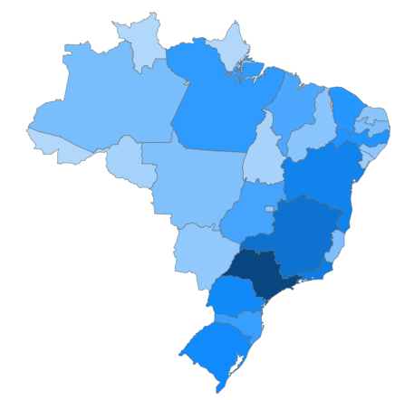
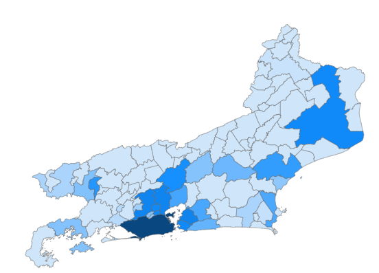

# Criando um mapa de estados do Brasil no Power BI

<p align="center">
  
</p>

## Importar e transformar os dados de população dos estados (Wikipédia)

1. Abra o **Power BI Desktop**.
2. Clique em **Obter dados** > **Web**.
3. Cole o seguinte endereço da Wikipédia:

   ```
   https://pt.wikipedia.org/wiki/Lista_de_unidades_federativas_do_Brasil_por_popula%C3%A7%C3%A3o
   ```

4. Selecione a tabela **"Unidades federativas do Brasil por população"** que apresenta os dados das populações por estado e clique em **Transformar dados**.
5. Clique em **Remover Linhas Superiores** e informe o valor **1**.
6. Clique em **Remover Linhas Inferiores** e informe o valor **1**.
7. Crie uma **Coluna Personalizada** chamada **Populacao** utilizando a fórmula abaixo:

   ```powerquery
   Int64.From(Text.Select([#"População[3][4]"], {"0".."9"}))
   ```

8. Selecione as colunas **Unidade federativa** e **Populacao**.
9. Clique em **Remover Outras Colunas**.

---

## Importar o arquivo TopoJSON e criar o mapa dos estados

1. No **Power BI Desktop**, adicione o visual **Mapa de formas (Shape Map)**.
2. Arraste a coluna **Populacao** para **Saturação da cor**.
3. Arraste a coluna **Unidade federativa** para **Localização**.
4. Abra **Formatar visual**.
5. Em **Configurações do mapa**, altere **Tipo de mapa** para **Mapa personalizado**.
6. Adicione o arquivo **`brazil.states.topo.json`**, disponível na pasta **Mapas JSON** deste diretório.
7. Em **Cores** > **Saturação da cor**, configure as cores e os valores para representar os menores e maiores valores de população.

---

> [!NOTE]
> O Power BI possui uma opção nativa chamada **Brasil: estados** em **Tipo de mapa**. No entanto, para utilizá-la corretamente, os nomes dos estados na coluna de localização devem estar **sem acentos**.

---

<br>

# Criando um mapa de municípios do estado do Rio de Janeiro no Power BI

<p align="center">
  
</p>

## Importar e transformar os dados de população dos municípios do estado do Rio de Janeiro (Wikipédia)

1. Abra o **Power BI Desktop**.
2. Clique em **Obter dados** > **Web**.
3. Cole o seguinte endereço da Wikipédia:

   ```
   https://pt.wikipedia.org/wiki/Lista_de_munic%C3%ADpios_do_Rio_de_Janeiro_por_popula%C3%A7%C3%A3o
   ```

4. Selecione a tabela **"Tabela 5"** que apresenta os dados das populações por estado e clique em **Transformar dados**.
5. Crie uma **Coluna Personalizada** chamada **Populacao** utilizando a fórmula abaixo:

   ```powerquery
   Int64.From(Text.Select([Column3], {"0".."9"}))
   ```

6. Renomeie a coluna **Column2** para **Cidade**;
7. Selecione as colunas **Cidade** e **Populacao**.
8. Clique em **Remover Outras Colunas**.
9. Renomeie a consulta de **Tabela 5** para **RJ Populacao**

---

## Acrescentar os dados de código do IBGE dos municípios do estado do Rio de Janeiro (Wikipédia)

10. Abra o **Power BI Desktop**.
11. Clique em **Obter dados** > **Web**.
12. Cole o seguinte endereço da Wikipédia:

   ```
   https://pt.wikipedia.org/wiki/Lista_de_munic%C3%ADpios_do_Rio_de_Janeiro
   ```

13. Selecione a tabela **"Tabela 2"** que apresenta os dados dos códigos do IBGE por município e clique em **Transformar dados**.
14. Renomeie a tabela de para **RJ Código IBGE**
15. Volte para a consulta **RJ Populacao** e clique no botão **Mesclar consultas**.
16. Selecione as colunas **"Cidade"** de **RJ Populacao** e **"Municipio"** de **RJ Código IBGE**.
17. Mantenha o tipo de junção **Externa esquerda**.
18. Clique na opção **Usar a correspondência difusa para executar a mesclagem**.
19. Na tabela mesclada, clique na seta e selecione apenas a coluna **CódigoIBGE**.

## Importar o arquivo TopoJSON e criar o mapa dos municípios

1. No **Power BI Desktop**, adicione o visual **Mapa de formas (Shape Map)**.
2. Arraste a coluna **Populacao** para **Saturação da cor**.
3. Arraste a coluna **CódigoIBGE** para **Localização**.
4. Abra **Formatar visual**.
5. Em **Configurações do mapa**, altere **Tipo de mapa** para **Mapa personalizado**.
6. Adicione o arquivo **`33.json`**, disponível na pasta **Mapas JSON** deste diretório.
7. Em **Cores** > **Saturação da cor**, configure as cores e os valores para representar os menores e maiores valores de população.

---

> [!NOTE]
> Este exemplo utiliza o estado do Rio de Janeiro. Para criar mapas de municípios de outros estados, obtenha os dados de população na página correspondente da Wikipédia e utilize o arquivo **TopoJSON** do estado desejado disponível no repositório **TopoJsonBrasil**:
>
> https://github.com/arthurwallace/TopoJsonBrasil

---
